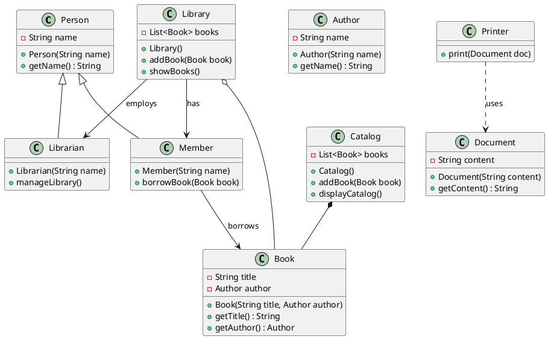

Let's create a scenario where we can use all the above relationships (Association, Aggregation, Composition, Inheritance, and Dependency) in a comprehensive example.

### Scenario: Online Library Management System

#### Classes:
1. `Library`
2. `Book`
3. `Author`
4. `Member`
5. `Librarian`
6. `Catalog`
7. `Printer`
8. `Document`

### Relationships:
1. **Association**: A `Member` can borrow a `Book`.
2. **Aggregation**: A `Library` contains many `Books`.
3. **Composition**: A `Catalog` is composed of `Books`.
4. **Inheritance**: `Librarian` and `Member` inherit from `Person`.
5. **Dependency**: `Printer` uses `Document` to print details.

### Java Implementation

```java
import java.util.List;
import java.util.ArrayList;

// Person class (Base class)
class Person {
    private String name;

    public Person(String name) {
        this.name = name;
    }

    public String getName() {
        return name;
    }
}

// Librarian class (inherits from Person)
class Librarian extends Person {
    public Librarian(String name) {
        super(name);
    }

    public void manageLibrary() {
        System.out.println(getName() + " is managing the library.");
    }
}

// Member class (inherits from Person and borrows Book)
class Member extends Person {
    public Member(String name) {
        super(name);
    }

    public void borrowBook(Book book) {
        System.out.println(getName() + " is borrowing " + book.getTitle());
    }
}

// Book class (part of Library and Catalog)
class Book {
    private String title;
    private Author author;

    public Book(String title, Author author) {
        this.title = title;
        this.author = author;
    }

    public String getTitle() {
        return title;
    }

    public Author getAuthor() {
        return author;
    }
}

// Author class (writes Book)
class Author {
    private String name;

    public Author(String name) {
        this.name = name;
    }

    public String getName() {
        return name;
    }
}

// Library class (aggregates Books)
class Library {
    private List<Book> books;

    public Library() {
        books = new ArrayList<>();
    }

    public void addBook(Book book) {
        books.add(book);
    }

    public void showBooks() {
        for(Book book : books) {
            System.out.println(book.getTitle() + " by " + book.getAuthor().getName());
        }
    }
}

// Catalog class (composes Books)
class Catalog {
    private List<Book> books;

    public Catalog() {
        books = new ArrayList<>();
    }

    public void addBook(Book book) {
        books.add(book);
    }

    public void displayCatalog() {
        for(Book book : books) {
            System.out.println(book.getTitle() + " by " + book.getAuthor().getName());
        }
    }
}

// Printer class (depends on Document)
class Printer {
    public void print(Document doc) {
        System.out.println("Printing document: " + doc.getContent());
    }
}

// Document class
class Document {
    private String content;

    public Document(String content) {
        this.content = content;
    }

    public String getContent() {
        return content;
    }
}

public class Main {
    public static void main(String[] args) {
        // Creating objects
        Author author = new Author("George Orwell");
        Book book1 = new Book("1984", author);
        Book book2 = new Book("Animal Farm", author);

        Library library = new Library();
        library.addBook(book1);
        library.addBook(book2);

        Catalog catalog = new Catalog();
        catalog.addBook(book1);
        catalog.addBook(book2);

        Member member = new Member("Alice");
        member.borrowBook(book1);

        Librarian librarian = new Librarian("Bob");
        librarian.manageLibrary();

        Document doc = new Document("Library Report");
        Printer printer = new Printer();
        printer.print(doc);

        library.showBooks();
        catalog.displayCatalog();
    }
}
```

### Diagram (Markdown)




### Explanation of Relationships in the Scenario

1. **Association**: `Member` can borrow a `Book`.
2. **Aggregation**: `Library` contains many `Books`, but `Books` can exist without the `Library`.
3. **Composition**: `Catalog` is composed of `Books`, and the `Books` cannot exist without the `Catalog`.
4. **Inheritance**: `Librarian` and `Member` inherit from `Person`.
5. **Dependency**: `Printer` uses `Document` to print details.

By putting all these relationships into a single example, you can see how different types of class relationships interact within a system. The above Java implementation and PlantUML diagram should provide a comprehensive overview.