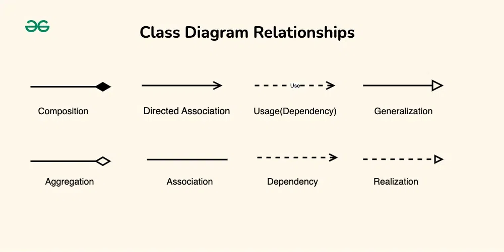
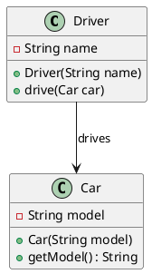
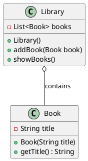
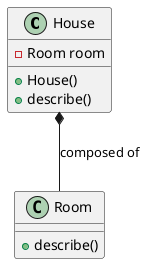
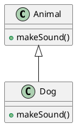
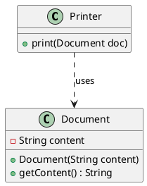

 Markdown:

### 1. Association

**Definition:**
- Association represents a relationship between two classes that allows one object instance to cause another to perform an action on its behalf. It is a "using" relationship and is typically represented with a straight line between the classes.

**Why We Use:**
- To show a logical connection between classes that work together within a system.

**Where to Use:**
- When one class needs to interact with another class, but they do not depend on each other for their lifecycle.

**Java Implementation:**

```java
class Driver {
    private String name;
    
    public Driver(String name) {
        this.name = name;
    }

    public void drive(Car car) {
        System.out.println(this.name + " is driving " + car.getModel());
    }
}

class Car {
    private String model;
    
    public Car(String model) {
        this.model = model;
    }

    public String getModel() {
        return model;
    }
}

public class Main {
    public static void main(String[] args) {
        Driver driver = new Driver("John");
        Car car = new Car("Toyota");
        driver.drive(car);
    }
}
```

**Diagram (Markdown):**





**Limitations:**
- Associations do not indicate ownership. The lifecycle of objects is managed independently.

### 2. Aggregation

**Definition:**
- Aggregation is a special form of association that represents a "whole-part" relationship. The part can exist independently of the whole.

**Why We Use:**
- To depict a relationship where one class is a part of another, but can also exist independently.

**Where to Use:**
- When a class (whole) contains another class (part) but the contained class can exist without the container.

**Java Implementation:**

```java
import java.util.List;
import java.util.ArrayList;

class Library {
    private List<Book> books;
    
    public Library() {
        books = new ArrayList<>();
    }

    public void addBook(Book book) {
        books.add(book);
    }

    public void showBooks() {
        for(Book book : books) {
            System.out.println(book.getTitle());
        }
    }
}

class Book {
    private String title;
    
    public Book(String title) {
        this.title = title;
    }

    public String getTitle() {
        return title;
    }
}

public class Main {
    public static void main(String[] args) {
        Library library = new Library();
        Book book1 = new Book("1984");
        Book book2 = new Book("Brave New World");

        library.addBook(book1);
        library.addBook(book2);
        
        library.showBooks();
    }
}
```

**Diagram (Markdown):**




**Limitations:**
- Aggregation implies a relationship but not a strong ownership. The lifecycle of the part is not managed by the whole.

### 3. Composition

**Definition:**
- Composition is a strong form of aggregation where the part cannot exist without the whole. The whole controls the lifecycle of the part.

**Why We Use:**
- To show strong ownership and a "whole-part" relationship where the part's lifecycle is dependent on the whole.

**Where to Use:**
- When one class is entirely composed of other classes and the parts cannot exist independently.

**Java Implementation:**

```java
class House {
    private Room room;
    
    public House() {
        room = new Room();
    }

    public void describe() {
        room.describe();
    }
}

class Room {
    public void describe() {
        System.out.println("This is a room in the house.");
    }
}

public class Main {
    public static void main(String[] args) {
        House house = new House();
        house.describe();
    }
}
```

**Diagram (Markdown):**




**Limitations:**
- Composition implies a strong ownership and lifecycle dependency, meaning that when the whole is destroyed, the parts are also destroyed.

### 4. Inheritance

**Definition:**
- Inheritance represents an "is-a" relationship where a subclass inherits attributes and methods from a superclass.

**Why We Use:**
- To promote code reuse and establish a natural hierarchy within the classes.

**Where to Use:**
- When there is a need to create a new class based on an existing class.

**Java Implementation:**

```java
class Animal {
    public void makeSound() {
        System.out.println("Some generic animal sound");
    }
}

class Dog extends Animal {
    @Override
    public void makeSound() {
        System.out.println("Bark");
    }
}

public class Main {
    public static void main(String[] args) {
        Animal myDog = new Dog();
        myDog.makeSound();
    }
}
```

**Diagram (Markdown):**




**Limitations:**
- Overusing inheritance can lead to a fragile base class problem where changes to the superclass affect all subclasses.

### 5. Dependency

**Definition:**
- Dependency represents a "uses-a" relationship where one class depends on another to function.

**Why We Use:**
- To indicate that one class relies on another class for its operations.

**Where to Use:**
- When a class uses another class in its methods.

**Java Implementation:**

```java
class Printer {
    public void print(Document doc) {
        System.out.println("Printing document: " + doc.getContent());
    }
}

class Document {
    private String content;
    
    public Document(String content) {
        this.content = content;
    }

    public String getContent() {
        return content;
    }
}

public class Main {
    public static void main(String[] args) {
        Document doc = new Document("Hello, world!");
        Printer printer = new Printer();
        printer.print(doc);
    }
}
```

**Diagram (Markdown):**




**Limitations:**
- High dependency can make the system hard to maintain and change since one class directly relies on the functionality of another.

---

These examples cover the main relationships in class diagrams with their definitions, uses, limitations, and implementations in Java. The Markdown diagrams provide a way to visualize these relationships effectively.